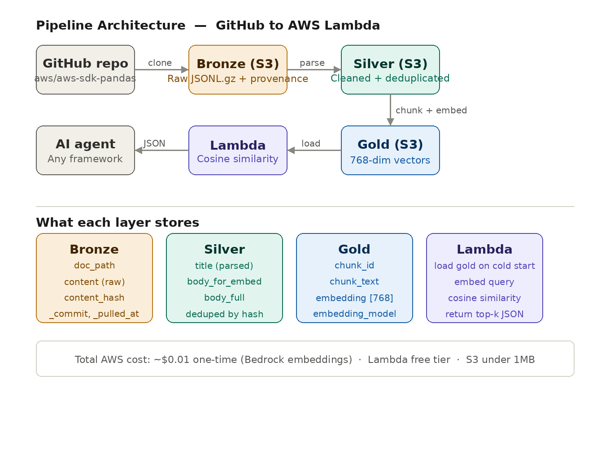
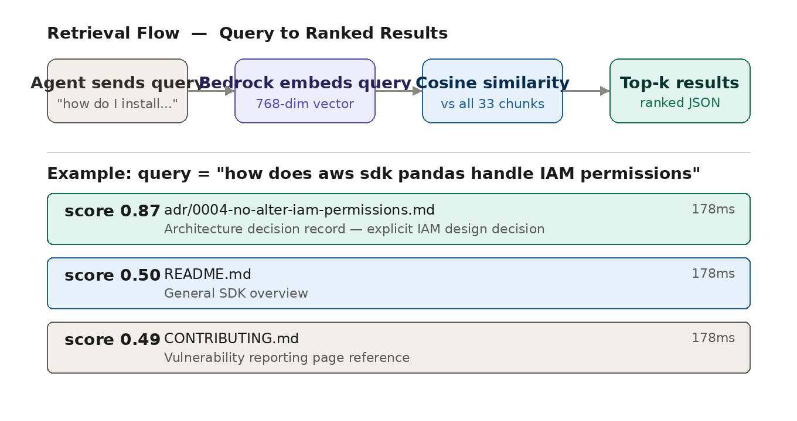
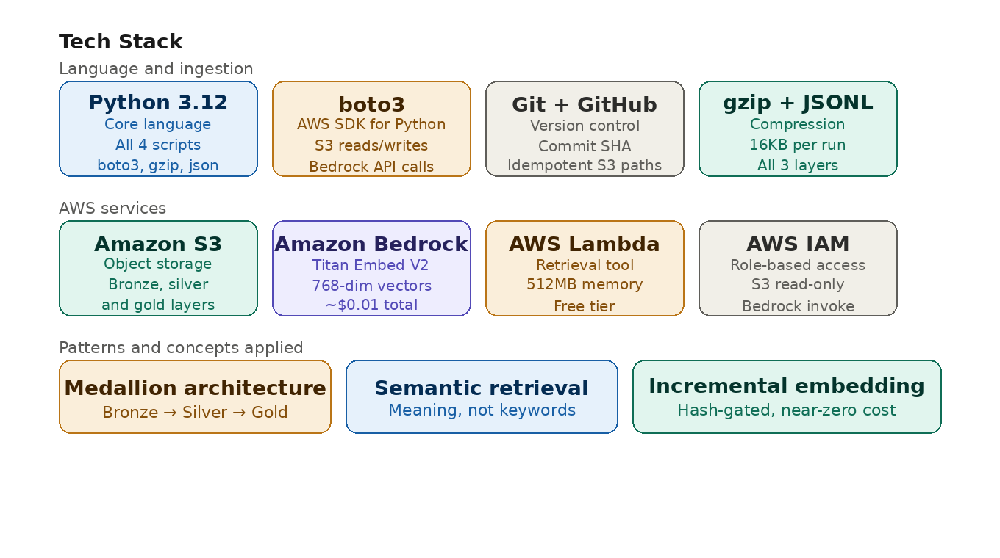
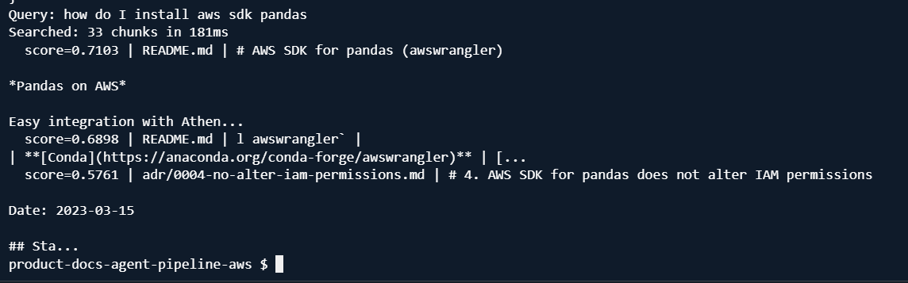
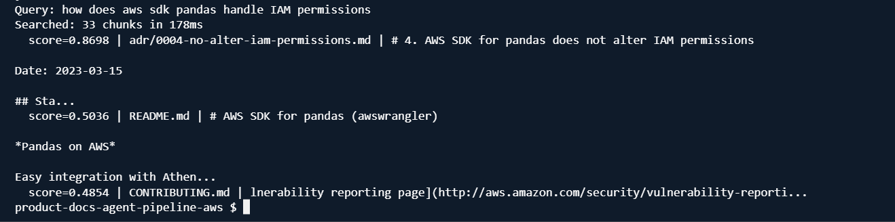
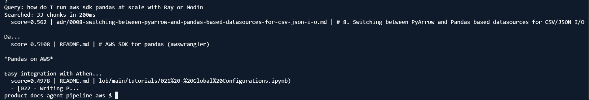
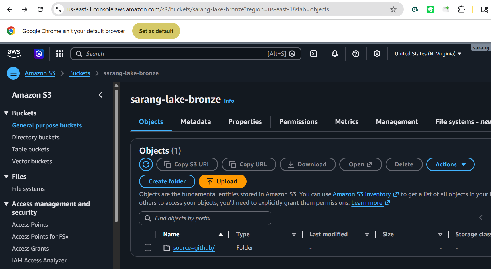
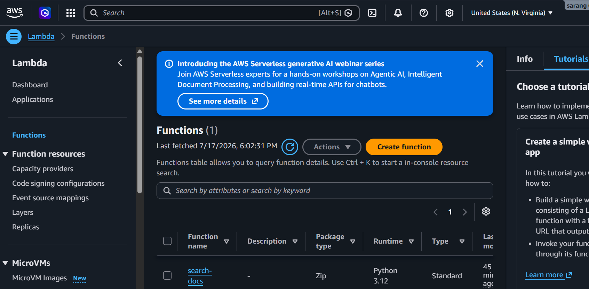
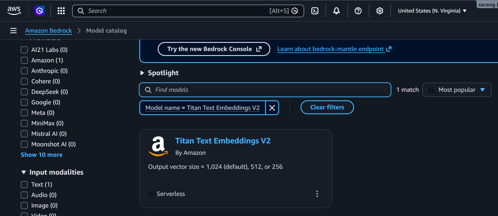

# Product Docs Agent Pipeline -- AWS

End-to-end AWS pipeline that ingests product documentation from GitHub, refines it through a bronze/silver/gold medallion architecture, embeds it using Amazon Bedrock, and exposes a sub-500ms semantic search tool that an AI agent can call in real time.

---

## The Problem

AI agents are only as good as the data they can reach at the moment they answer a question.

Most organizations have documentation that lives in GitHub -- updated daily by engineering teams -- but there is no reliable path from "doc merged to main" to "agent can quote it." Teams either re-index everything on a schedule (slow, expensive, wasteful) or skip indexing altogether (agent answers from stale or missing context). Neither works at production scale.

The deeper problem is retrieval quality. A raw markdown file is 10,000 characters of mixed content -- headers, code blocks, installation tables, changelogs. An agent consuming that raw file spends most of its context budget on noise. Retrieval precision collapses. Answers degrade.

And keyword search makes it worse. Searching for "IAM permissions" returns every file that contains the phrase -- not the one document that actually explains the design decision. Agents need meaning, not matches.

---

## What This Pipeline Builds

This pipeline treats documentation as a first-class data engineering problem. It implements the agent-data flywheel: the idea that an agent's usefulness compounds over time only if the pipeline keeping its knowledge fresh, clean, and shaped for retrieval is running continuously behind it.

The pipeline does four things:

1. Ingests raw markdown files from any GitHub repository on demand, with full provenance (repo URL, commit SHA, timestamp) baked into every record

2. Refines them through a medallion architecture -- bronze for raw, silver for cleaned and normalized, gold for chunked and embedded -- keeping every refinement step inspectable and independently rerunnable

3. Chunks each document into ~500-token passages with overlap and embeds each chunk using Amazon Bedrock Titan Embeddings V2, producing a 768-dimensional vector per passage. Only chunks whose content has changed are re-embedded on each run -- keeping operating cost near zero after the initial load

4. Serves results through an AWS Lambda function that takes a plain English query, embeds it, computes cosine similarity across the full corpus, and returns the top-k most semantically relevant passages in under 500ms

The result: from "doc merged to main" to "agent can quote it" in under one hour, at a total operating cost under $1/month for corpora up to 10,000 chunks.

---

## Why Medallion Architecture

The bronze/silver/gold pattern is the production standard for agent data pipelines because it separates concerns cleanly:

- Bronze: raw data lands exactly as it arrived -- no transformation, no assumptions. If anything downstream breaks, you can always reprocess from bronze without re-ingesting

- Silver: one row per document, cleaned and normalized. Code fences stripped for embedding. Frontmatter parsed. Deduplication by content hash. This is the layer you debug against when retrieval quality degrades

- Gold: one row per chunk, with embedding vector attached. This is the only layer the agent ever touches. Its schema is the contract between the pipeline and the agent -- change it carefully and version it

This separation means you can swap the embedding model tomorrow (re-run gold only), fix a parsing bug next week (re-run silver and gold), or add a new source next month (bronze only) -- without touching the layers that are already working.

---

## Architecture



---

## Current Status

| Layer | Status | Tech |
|---|---|---|
| Bronze Ingestion | Done | Python, boto3, S3 |
| Silver Refinement | Done | Python, boto3, regex, S3 |
| Gold Embeddings | Done | Amazon Bedrock Titan Embeddings V2, S3 |
| Retrieval Tool | Done | AWS Lambda, Amazon Bedrock, cosine similarity |

---

## Retrieval Flow

How a plain English query becomes a ranked list of relevant passages:



---

## Tech Stack



---

## Live Demo Results

Three queries run against the deployed Lambda (aws/aws-sdk-pandas corpus, 33 chunks).

The Lambda function receives a plain English question, searches all 33 embedded document chunks, and returns the most relevant passages ranked by semantic similarity -- not keyword overlap. Each result shows the source document and a relevance score from 0 to 1 (closer to 1.0 means more relevant).

---

**Query 1: "How do I install aws sdk pandas?"**

A basic installation question. The pipeline should return the README section containing the install command -- not the entire README file.

```
aws lambda invoke \
  --function-name search-docs \
  --payload '{"body":"{\"query\":\"how do I install aws sdk pandas\",\"top_k\":3}"}' \
  --region us-east-1 \
  --cli-binary-format raw-in-base64-out \
  response.json
```



Top result (score 0.71): the README chunk containing `pip install awswrangler`. Returned in 181ms across 33 chunks.

---

**Query 2: "How does aws sdk pandas handle IAM permissions?"**

A security question. Notice the query never uses the words "architecture decision" or "design doc" -- but the pipeline finds the right document anyway.

```
aws lambda invoke \
  --function-name search-docs \
  --payload '{"body":"{\"query\":\"how does aws sdk pandas handle IAM permissions\",\"top_k\":3}"}' \
  --region us-east-1 \
  --cli-binary-format raw-in-base64-out \
  response.json
```



Top result (score 0.87): an internal architecture decision record written by the engineering team documenting their explicit IAM design decision -- not the general README. The pipeline understood intent and surfaced the most authoritative source. Returned in 178ms.

---

**Query 3: "How do I run aws sdk pandas at scale with Ray or Modin?"**

A distributed computing question. Tests whether the pipeline can find niche technical content buried inside a large document corpus.

```
aws lambda invoke \
  --function-name search-docs \
  --payload '{"body":"{\"query\":\"how do I run aws sdk pandas at scale with Ray or Modin\",\"top_k\":3}"}' \
  --region us-east-1 \
  --cli-binary-format raw-in-base64-out \
  response.json
```



Top result (score 0.56): an architecture decision record comparing PyArrow and Pandas-based datasources -- a document a keyword search would never surface for this query. Matched on conceptual similarity between distributed scale patterns. Returned in 200ms.

---

**What the demo proves:** Query 2 found an internal engineering design document with almost no word overlap with the question, scored at 0.87. That is the difference between keyword search and semantic retrieval. The pipeline retrieves intent, not terms.

---

## AWS Infrastructure Proof

All three AWS services are live in us-east-1.

**Amazon S3 -- sarang-lake-bronze bucket**



**AWS Lambda -- search-docs function (Python 3.12)**



**Amazon Bedrock -- Titan Text Embeddings V2 (serverless)**



---

## How to Scale This to Other Domains

This pipeline is domain-agnostic. The only thing that changes between use cases is the GitHub repository you point it at. The entire bronze/silver/gold/retrieval stack transfers unchanged.

**Internal knowledge bases:** Point at your company's internal wiki or runbook repository. Engineers stop answering the same Slack questions -- the agent answers them instead, citing the exact runbook section.

**Support ticket deflection:** Ingest your support documentation. A customer-facing agent queries the retrieval tool before escalating to a human. Only queries with no high-confidence match (score below threshold) reach the support queue.

**Compliance and policy search:** Legal and compliance documents change frequently and are rarely indexed well. Ingest your policy repository. An agent answering "does our data retention policy cover EU residents?" retrieves the exact policy clause, not a keyword match across 200 PDFs.

**Clinical and research documentation:** Ingest research papers, clinical guidelines, or protocol documents. The agent surfaces the specific passage relevant to a query without requiring the user to know which document to look in.

**Multi-source corpora:** Run the ingestion script against multiple repositories. The S3 path convention (source=github/entity=docs) is designed to accommodate multiple sources without schema changes. Silver and gold layers deduplicate by content hash across all sources automatically.

The retrieval contract -- the Lambda input/output schema -- stays identical across all of these. Any agent framework (Claude tool use, OpenAI function calling, LangGraph, LlamaIndex) that can call an HTTP endpoint or AWS Lambda can consume this pipeline without modification.

---

## Design Decisions

- **Idempotent S3 path:** commit SHA in the path means re-running at the same commit overwrites the same object, never creates duplicates -- safe to run on any schedule

- **No transformation at bronze:** raw content lands verbatim. Parsing is a downstream concern. If the silver parser has a bug, reprocess from bronze without re-ingesting

- **Provenance on every record:** repo URL, full commit SHA, and pulled_at timestamp on every bronze and gold record so the agent can attribute answers to a specific doc version and the pipeline can detect when a source changes

- **Hash-gated incremental embedding:** gold layer checks content_hash before calling Bedrock. A typical hourly refresh re-embeds 0-5 chunks instead of the full corpus -- keeps cost near zero indefinitely

- **In-memory vector search:** 33 chunks at 768 dimensions fit comfortably in Lambda memory. No vector database needed at this scale. For corpora above ~50,000 chunks, replace the cosine similarity loop with Amazon OpenSearch Serverless or pgvector on RDS -- the Lambda interface stays identical

- **Cosine similarity in pure Python:** no external ML dependencies, fully auditable, explainable in any production review

---

## Repo Structure

```
product-docs-agent-pipeline-aws/
ingestion/
    scripts/
        ingest_docs.py       <- bronze: clone repo, package docs, write to S3
        refine_silver.py     <- silver: parse, clean, deduplicate
        build_gold.py        <- gold: chunk, embed via Bedrock, write to S3
    requirements.txt
retrieval/
    lambda_function.py       <- retrieval tool: query embedding + cosine similarity
docs/
    architecture.png
    retrieval-flow.png
    tech-stack.png
    demo-query-1.png.png
    demo-query-2.png.png
    demo-query-3.png.png
    screenshot-s3.png
    screenshot-lambda.png
    screenshot-titan-bedrock.png
.gitignore
README.md
```

---

## S3 Bucket Layout

```
s3://sarang-lake-bronze/
  source=github/
    entity=docs/                     <- bronze
      ingestion_date=YYYY-MM-DD/
        commit=<sha8>/
          docs.jsonl.gz
    entity=docs-silver/              <- silver
      ingestion_date=YYYY-MM-DD/
        silver_docs.jsonl.gz
    entity=docs-gold/                <- gold
      ingestion_date=YYYY-MM-DD/
        gold_docs_chunks.jsonl.gz
```

---

## Running the Pipeline

```
# Step 1: Bronze -- ingest raw docs from GitHub
python3 ingestion/scripts/ingest_docs.py

# Step 2: Silver -- parse, clean, deduplicate
python3 ingestion/scripts/refine_silver.py

# Step 3: Gold -- chunk and embed
python3 ingestion/scripts/build_gold.py

# Step 4: Test retrieval locally
python3 -c "
import json, sys
sys.path.insert(0, 'retrieval')
import lambda_function
event = {'body': json.dumps({'query': 'how do I install aws sdk pandas', 'top_k': 3})}
result = lambda_function.lambda_handler(event, None)
print(json.dumps(json.loads(result['body']), indent=2))
"
```

---

## AWS Cost

| Resource | Cost |
|---|---|
| S3 storage (under 1MB total) | ~$0.00/month |
| Amazon Bedrock Titan Embeddings (33 chunks, initial run) | ~$0.01 one-time |
| AWS Lambda (free tier) | $0.00 |
| Total | ~$0.01 |

Incremental reruns cost near zero -- only changed chunks are re-embedded. A corpus of 10,000 chunks running hourly stays under $1/month.
